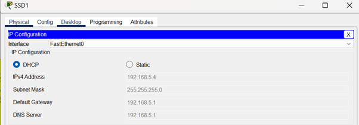
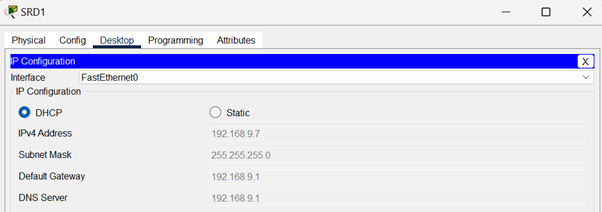
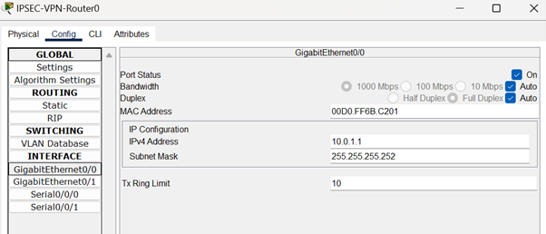

# Software-House-Topology-With-Secure-VPN-Communication-via-IPSec

Introduction
This project outlines the design and implementation of a network infrastructure for a software house comprising multiple departments. The network is built from scratch to ensure robust connectivity, logical segmentation, and secure communication between departments and remote sites. VLANs have been utilized for logical separation, RIPv2 for routing, and IPSEC VPN tunnelling for secure connections between locations.

Network Overview
1. Physical Network Layout:
•	Headquarters (HQ): Central office housing key departments and servers.
•	Research and Development (R&D): Dedicated site for R&D operations.
•	External Server: Email server hosted on the cloud.
2. Logical Network Design:
•	VLANs are implemented to segregate departments logically.
•	RIPv2 is configured for dynamic routing across the network.
•	IPSEC VPN ensures secure communication between HQ and R&D locations.

3. Router Names and IP Addressing:
•	HQ-Router
•	R&D-Router
•	IPSEC-VPN-Router0 
o	VPN Connection IP: 10.0.0.9
o	Connection to HQ: 10.0.1.1
•	IPSEC-VPN-Router1 
o	VPN Connection IP: 10.0.0.10
o	Connection to R&D: 10.0.2.1

In this project, we will design and configure a network for a large software house with two branches: HQ and R&D. The two branches are situated 20 miles apart and communicate securely via IPSEC-VPN tunnelling.

HQ Branch
The HQ branch consists of three buildings housing eight departments:
1.	Administration
2.	Finance
3.	Human Resources (HR)
4.	Senior Software Developers
5.	Junior Software Developers
6.	Cyber Security
7.	Marketing
8.	Support Services
Each department at HQ will have its own dedicated IP subnet to ensure proper segmentation and management of network traffic.

R&D Branch
The R&D branch consists of one building housing two departments:
1.	Senior R&D
2.	Junior R&D
Each department in the R&D branch will also have its own subnet for optimized traffic routing and security.

Network Objectives
1.	Secure Communication: Establish IPSEC-VPN tunnels between HQ and R&D for secure, encrypted communication.
2.	End-to-End Connectivity: Provide seamless connectivity for all departments across both branches.
3.	Internal and External Server Access: Ensure all users can access internal resources and external servers.
4.	Departmental Segmentation: Allocate unique IP subnets for each department to isolate traffic and enhance security.
5.	Routing Protocol: Implement RIPv2 as the routing protocol for intra-branch communication.
This configuration will ensure that all users across the HQ and R&D branches can securely access resources, maintain high availability, and achieve optimal network performance.

Topology:

 

HQ:
Building A:

 
Building B:
 

Building C:

 
These 3 Buildings Connected VIA A Multi-layered Switch

R&D Branch:

 
These 2 Departments Connected VIA A Multi-layered Switch
Devices Used:
•	2960-24TT Switches x10
•	3560-24PS Switches x2
•	2911 Routers x3
•	2901 Routers x2
•	Server PT x 2
•	PC’s x78
•	Printers x10

IP Assigning:
PC’s IP Assigning Done VIA DHCP:
 
 

 

 

Admin (VLAN 10):

Finance (VLAN 20):
 

Support Service (VLAN 30):

 
HR (VLAN 40):

Senior Software Developer (VLAN 50):

 
Junior Software Developer (VLAN 60):

 
Cyber Security (VLAN 70):

 

Marketing (VLAN 80):
 

Senior R&D (VLAN 90):

 
Junior R&D (VLAN 100):
 

HQ-Router:

R&D-Router:

 

IPSEC-VPN-Router0:

 

 
 
IPSEC-VPN-Router1:
 
 

 
 

Web Server:
A web server is a system that stores, processes, and delivers web pages to clients (such as web browsers) over the internet or an intranet. It responds to client requests using HTTP (HyperText Transfer Protocol) or HTTPS (HTTP Secure). Web servers are essential for hosting websites and web applications, enabling users to access content or services online.
How a Web Server Works:
1.	Client Request:
o	A client (e.g., a browser) sends an HTTP/HTTPS request to the web server by entering a URL or clicking a link.
2.	Processing the Request:
o	The web server interprets the request and locates the requested resource, such as an HTML file, image, or web application.
o	If the requested resource involves dynamic content (e.g., PHP or Python scripts), the server processes it using back-end technologies.
3.	Response Delivery:
o	The server sends the requested resource (or an error message if unavailable) back to the client.
o	The client renders the resource for the user.
Key Components of a Web Server:
1.	Software:
o	Examples include Apache, Nginx, Microsoft IIS, and LiteSpeed. These manage requests, serve static files, and integrate with application servers for dynamic content.
2.	Hardware:
o	The physical machine or virtual server hosting the web server software, equipped with sufficient CPU, memory, and storage to handle client requests.
3.	Static and Dynamic Content:
o	Static Content: Predefined files like HTML, CSS, and images stored on the server.
o	Dynamic Content: Generated in real time using scripting languages (e.g., PHP, Python) and databases.
4.	Protocols:
o	HTTP/HTTPS: Used to transfer data between the server and clients.
o	SSL/TLS: Secures communication with encryption for HTTPS.
5.	Configuration Files:
o	Used to define settings like hostnames, ports, security policies, and logging (e.g., .conf files in Apache).
Benefits of a Web Server:
1.	Content Delivery:
o	Serves static and dynamic content efficiently to users worldwide.
2.	Centralized Management:
o	Enables centralized hosting and management of web applications.
3.	Scalability:
o	Can handle an increasing number of users by scaling hardware or deploying load balancers.
4.	Security:
o	Provides secure access via HTTPS and integrates with firewalls and authentication mechanisms.
5.	Customizability:
o	Allows administrators to configure server behavior, optimize performance, and set up virtual hosts for multiple websites.
Application in the Software House Scenario:
1.	Hosting Internal and External Applications:
o	The web server is used to host internal tools, such as employee portals for Admin, Finance, or HR departments.
o	External-facing web servers host the company website, customer portals, and marketing applications.
2.	Cross-Branch Access via VPN:
o	Employees at the R&D branch access the web server at HQ via the IPSEC VPN tunnel for secure connectivity.
3.	Departmental Integration:
o	Tools like issue trackers, document management systems, and dashboards for Junior/Senior Software Developers and Cyber Security are served by the web server.
4.	Dynamic Content Handling:
o	For Marketing and Support Services, the web server handles dynamic content (e.g., databases for customer support tickets or marketing analytics).
5.	Load Balancing and Failover:
o	In case of high traffic, a load balancer can distribute requests across multiple web servers, ensuring high availability.
Common Web Server Technologies:
1.	Apache HTTP Server:
o	Open-source, highly configurable, and widely used for hosting websites.
2.	Nginx:
o	Known for high performance, scalability, and efficient handling of concurrent requests.
3.	Microsoft IIS:
o	Integrated with Windows Server and suitable for hosting .NET applications.
4.	LiteSpeed:
o	Lightweight, high-speed server often used for WordPress hosting.
By deploying a web server, the software house ensures seamless delivery of internal and external services, enabling efficient collaboration across departments and branches. The web server forms the backbone of the organization’s online and intranet operations, supporting both employee productivity and customer engagement.
Web Server Setup:
 

Testing Web Server:

 

 

FTP Server (File Transfer Protocol Server):
An FTP server is a specialized software application or system that facilitates the transfer of files between a client and a server over a network using the File Transfer Protocol (FTP). It enables users to upload, download, or manage files stored on the server. FTP servers are widely used for file sharing, website maintenance, and collaborative work environments.
How an FTP Server Works:
1.	Client-Server Model:
o	The FTP server hosts files and directories, while the FTP client accesses them using credentials (username and password) or anonymously.
2.	File Transfer Modes:
o	Active Mode: The server initiates a data connection to the client.
o	Passive Mode: The client initiates both control and data connections, often used in NAT or firewall-protected environments.
3.	Data Transmission:
o	Files are transferred in binary or ASCII mode, depending on the file type.
4.	Communication Channels:
o	Control Channel: For commands (e.g., login, file requests) and server responses.
o	Data Channel: For the actual file transfer.
Key Features of an FTP Server:
1.	Authentication:
o	Supports user accounts and passwords for secure access control.
o	Optionally allows anonymous access for public file sharing.
2.	File Permissions:
o	Configurable permissions for reading, writing, or deleting files.
3.	Directory Structure:
o	Organized file storage with hierarchical directories.
4.	Logging and Monitoring:
o	Tracks user activities and file transfers for auditing.
5.	Security Enhancements:
o	Supports FTPS (FTP Secure) and SFTP (SSH File Transfer Protocol) for encrypted file transfers.
Benefits of an FTP Server:
1.	Efficient File Transfer:
o	Provides a fast and reliable method for transferring large files.
2.	Centralized File Management:
o	Stores files in a central location, ensuring easy access and organization.
3.	Cross-Platform Support:
o	Accessible from various operating systems and devices using FTP clients.
4.	Customizability:
o	Allows administrators to define user access levels and directory structures.
5.	Automation Support:
o	Enables scripting for scheduled or automated file transfers.
Application in the Software House Scenario:
1.	Internal File Sharing:
o	An FTP server at the HQ branch facilitates secure file sharing between departments like Admin, Finance, and HR.
o	Junior and Senior Software Developers use it for sharing project files and code repositories.
2.	Cross-Branch Collaboration:
o	The R&D branch accesses the FTP server at HQ via the IPSEC VPN tunnel for secure file transfers.
3.	Client Deliverables:
o	Marketing and Support Services teams use the FTP server to upload and download client-related files securely.
4.	Backup and Archiving:
o	Cyber Security uses the FTP server to store logs, reports, and backups securely.
5.	Access Control:
o	Different user accounts are set up for each department, restricting access to sensitive files.
6.	Automated Processes:
o	Scheduled file transfers for reports, logs, or backups ensure efficient workflows.
Common FTP Server Software:
1.	FileZilla Server:
o	Open-source, user-friendly, and supports FTP/SFTP.
2.	ProFTPD:
o	Highly configurable and secure, popular in Linux environments.
3.	vsftpd:
o	Known for security and performance in Unix/Linux systems.
4.	Microsoft IIS FTP:
o	Integrated with Windows Server, ideal for Windows-based networks.
5.	Pure-FTPd:
o	Lightweight and focused on simplicity and security.
Security Considerations:
1.	Use FTPS or SFTP:
o	Encrypts file transfers, protecting data from interception.
2.	Strong Authentication:
o	Enforce strong passwords and, if possible, use two-factor authentication (2FA).
3.	Firewall Configuration:
o	Configure firewalls to allow only necessary ports (e.g., port 21 for FTP).
4.	Access Control Lists (ACLs):
o	Define permissions to restrict access to sensitive directories and files.
By deploying an FTP server, the software house ensures efficient, secure, and centralized file sharing across departments and branches. It supports collaborative workflows, streamlines file management, and enhances overall productivity in a distributed working environment.

FTP Server Setup:
 

Testing FTP Server:
 

 
 
VLAN (Virtual Local Area Network):
A VLAN is a logical grouping of devices on a network, allowing them to communicate as if they were on the same physical network, even if they are located across different physical segments. VLANs provide segmentation, improved security, and enhanced network efficiency by separating devices into distinct broadcast domains.

How VLAN Works:
1.	Logical Segmentation:
o	VLANs divide a single physical network into multiple logical networks. Each VLAN is identified by a unique VLAN ID.
o	Devices within the same VLAN can communicate directly, while devices in different VLANs require a router or a Layer 3 switch to communicate.
2.	Trunking:
o	Trunk links are used to carry traffic for multiple VLANs between switches.
o	IEEE 802.1Q is the most common VLAN tagging protocol used to identify VLAN traffic on trunk links.
3.	Broadcast Domains:
o	Each VLAN creates its own broadcast domain, limiting the spread of broadcast traffic to only the devices in that VLAN.
Components of VLAN:
1.	Access Ports:
o	Connect end devices (e.g., PCs, printers) to a specific VLAN. Each port is configured for a single VLAN.
2.	Trunk Ports:
o	Connect switches and carry traffic for multiple VLANs using tagging.
3.	VLAN Tagging:
o	Ensures that traffic traveling over a trunk link is associated with the correct VLAN.
Benefits of VLANs:
1.	Segmentation:
o	Separates devices based on departments or functions (e.g., Finance, HR, R&D), improving traffic management and reducing congestion.
2.	Improved Security:
o	Sensitive departments (e.g., Finance, Cyber Security) can be isolated from other departments, reducing the risk of unauthorized access.
3.	Broadcast Control:
o	Reduces unnecessary broadcast traffic by limiting broadcasts to specific VLANs.
4.	Flexibility:
o	Devices can be grouped into VLANs based on their function, not their physical location.
Application in the Software House Scenario:
1.	Departmental Segmentation:
o	Each department in HQ (e.g., Admin, HR, Cyber Security) and R&D (Senior R&D, Junior R&D) can be assigned to its own VLAN.
o	This ensures that traffic from one department does not interfere with another and improves security.
2.	Inter-VLAN Routing:
o	A Layer 3 switch or a router will be used to enable communication between VLANs (e.g., between Junior Software Developers and Cyber Security).
3.	Traffic Optimization:
o	VLANs reduce congestion by isolating traffic within departments, ensuring that high-priority data (e.g., R&D research) is not affected by other traffic.
4.	Enhanced Security:
o	Sensitive departments like Cyber Security can have their VLAN traffic monitored and controlled separately, reducing the risk of data breaches.
5.	Scalability:
o	VLANs make it easier to add new departments or reorganize existing ones without requiring physical changes to the network.
Using VLANs allows the software house to achieve a structured, secure, and efficient network design. It enhances traffic control, provides isolation for sensitive departments, and supports the scalability needed for future growth.

Configuring VLAN On Layer 2 Switch (access layer):

Admin-Switch:
 

Finance-Switch:

Support Service-Switch:
 

HR-Switch:
 

Senior_software_dev-Switch:
 

Junior_software_dev-Switch:
 

Cyber_security-Switch:
 

Marketing-Switch:

 

SRD-Switch:

 

Junior_R&D-Switch:

 
HQ-Switch:

Trunk mode:
 

R&D-Switch:

 
Trunk mode:

 

Basic Router Configurations:
HQ-Router:
 

R&D-Router:

 

Inter-VLAN Routing:
Inter-VLAN Routing refers to the process of enabling communication between devices on different VLANs. While VLANs provide logical segmentation of the network, they also create isolated broadcast domains. To allow devices in separate VLANs to communicate, inter-VLAN routing is required, typically performed by a Layer 3 device such as a router or a Layer 3 switch.

How Inter-VLAN Routing Works:
1.	Traditional Router-on-a-Stick:
o	A single router interface is configured as a trunk port and connected to a switch.
o	Sub-interfaces are created on the router, each assigned to a specific VLAN and an IP address as the default gateway for that VLAN.
o	The router routes traffic between VLANs by tagging and untagging packets based on VLAN IDs.
2.	Layer 3 Switch:
o	A Layer 3 switch performs both switching and routing functions, allowing faster inter-VLAN communication.
o	Each VLAN is assigned an SVI (Switched Virtual Interface), which serves as the default gateway for devices in that VLAN.
o	The switch routes traffic directly without needing an external router.
Components of Inter-VLAN Routing:
1.	Default Gateway:
o	Each VLAN is assigned an IP address that acts as the gateway for devices in that VLAN to communicate with devices in other VLANs.
2.	Routing Table:
o	The router or Layer 3 switch maintains a routing table to determine how to forward traffic between VLANs.
3.	VLAN Tagging:
o	Tags are used to identify VLAN-specific traffic when packets traverse trunk links.
Benefits of Inter-VLAN Routing:
1.	Seamless Communication:
o	Allows different departments (e.g., HR and Finance) to share data and collaborate while maintaining logical segmentation.
2.	Efficient Resource Sharing:
o	Enables shared access to central resources, such as printers, servers, or databases, across VLANs.
3.	Centralized Management:
o	Traffic between VLANs can be monitored and controlled through the routing device, enhancing network security and efficiency.
4.	Scalability:
o	Easily supports additional VLANs and inter-VLAN communication as the organization grows.
Application in the Software House Scenario:
1.	Connecting HQ Departments:
o	Each department in HQ (e.g., Finance, Cyber Security, Marketing) is on its own VLAN. Inter-VLAN routing allows them to access shared resources such as databases, file servers, and printers.
2.	Facilitating Cross-Branch Communication:
o	When combined with IPSEC VPN tunneling, inter-VLAN routing ensures that devices in HQ and R&D can communicate seamlessly while maintaining their logical separation.
3.	Layer 3 Switch for HQ:
o	A Layer 3 switch is deployed at HQ to handle inter-VLAN traffic efficiently, reducing the need for an external router and improving network performance.
4.	Router-on-a-Stick for R&D:
o	Since the R&D branch has fewer VLANs (Senior R&D and Junior R&D), a router-on-a-stick configuration can be used for cost-effective inter-VLAN routing.
5.	Improved Security:
o	Traffic between sensitive departments like Cyber Security and Junior Software Developers can be routed through firewalls or monitored for compliance, ensuring data protection.
By implementing inter-VLAN routing, the software house can achieve seamless communication between departments while maintaining the segmentation and security provided by VLANs. It ensures efficient use of resources and facilitates both intra- and inter-branch connectivity.
Inter-VLAN Routing Configurations:

HQ-Router:
 
 

R&D-Router:

 

DHCP (Dynamic Host Configuration Protocol):
DHCP is a network management protocol used to automatically assign IP addresses and other network configuration settings to devices on a network. This eliminates the need for manual configuration and ensures efficient use of IP addresses.
How DHCP Works:
1.	DHCP Server:
o	A DHCP server is configured on a dedicated device (e.g., router, switch, or server) to manage and allocate IP addresses dynamically.
2.	DHCP Process (DORA):
The process involves four key steps:
o	Discovery: A client device sends a broadcast request to locate a DHCP server.
o	Offer: The DHCP server responds with an available IP address and other configuration options.
o	Request: The client requests to lease the offered IP address.
o	Acknowledgment: The DHCP server confirms the lease, and the client begins using the assigned IP.
3.	Configuration Options Provided by DHCP:
o	IP Address
o	Subnet Mask
o	Default Gateway
o	DNS Server Addresses
o	Lease Duration
Benefits of DHCP:
1.	Automatic IP Assignment:
o	Reduces administrative overhead by automatically assigning IP addresses to devices.
2.	Efficient Use of IPs:
o	Prevents IP conflicts and optimizes the allocation of IP addresses within a subnet.
3.	Centralized Management:
o	Enables centralized control over network configuration settings.
4.	Scalability:
o	Simplifies the management of IP addresses as the network grows, accommodating new devices without manual configuration.
Application in the Software House Scenario:
1.	HQ Branch DHCP Server:
o	A DHCP server is set up at HQ to dynamically assign IP addresses to devices in each department (e.g., Marketing, Finance, Cyber Security).
o	The server is configured to provide separate IP address pools for each VLAN, ensuring proper segregation and management of IPs.
2.	R&D Branch DHCP Configuration:
o	A separate DHCP server or relay agent is used in the R&D branch to assign IP addresses to devices in Senior R&D and Junior R&D departments.
3.	Inter-Branch IP Management:
o	With IPSEC VPN tunneling, DHCP relays can be used to allow the central DHCP server at HQ to manage IP assignments for both HQ and R&D, if required.
4.	Failover and Redundancy:
o	To ensure uninterrupted service, a secondary DHCP server can be configured as a failover in case the primary server becomes unavailable.
5.	Improved Mobility:
o	Employees moving between branches or departments can seamlessly connect to the network without needing manual IP reconfiguration.
DHCP Configuration in VLAN Environments:
1.	DHCP and VLAN Integration:
o	Each VLAN has its own DHCP scope (range of IP addresses). A DHCP server or relay agent is configured to ensure that devices in each VLAN receive IP addresses from the correct pool.
2.	DHCP Relay Agent:
o	When VLANs span multiple subnets, a DHCP relay agent is configured on switches or routers to forward DHCP requests from clients in different VLANs to the central DHCP server.
By implementing DHCP, the software house ensures efficient IP management, reduces administrative tasks, and provides seamless connectivity for devices across both branches. It enhances scalability and supports dynamic environments where devices frequently connect and disconnect from the network.
DHCP Configurations:

HQ-Router:

 
R&D-Router:

 
RIPv2 (Routing Information Protocol Version 2):
RIPv2 is a distance-vector routing protocol used to exchange routing information between routers in a network. It is an enhancement of RIPv1, supporting classless inter-domain routing (CIDR), subnet masks, and authentication. RIPv2 is simple to configure and suitable for smaller networks.
How RIPv2 Works:
1.	Distance Vector Algorithm:
o	RIPv2 uses the number of hops (routers) as the metric to determine the best route. The maximum allowable hop count is 15, making RIPv2 ideal for smaller networks.
2.	Periodic Updates:
o	Routers exchange routing tables every 30 seconds to maintain up-to-date routing information.
3.	Key Features of RIPv2:
o	Classless Routing: Supports variable-length subnet masks (VLSM) for efficient IP address usage.
o	Multicast Updates: Sends updates to multicast address 224.0.0.9, reducing unnecessary traffic compared to RIPv1.
o	Authentication: Provides a mechanism to authenticate routing updates, enhancing security.
4.	Route Selection:
o	Routes are selected based on the lowest hop count. In case of multiple routes with the same hop count, load balancing can occur.

Benefits of RIPv2:
1.	Simplicity:
o	Easy to configure and manage, making it ideal for networks with minimal routing complexity.
2.	Support for CIDR and VLSM:
o	Enables efficient use of IP addresses by supporting classless addressing.
3.	Multicast Communication:
o	Reduces unnecessary bandwidth usage by limiting routing updates to routers only.
4.	Authentication:
o	Prevents malicious or unintended routing updates, ensuring network integrity.
Application in the Software House Scenario:
1.	Routing Between HQ VLANs:
o	RIPv2 is used to route traffic between VLANs (e.g., Finance, Marketing, Cyber Security) within the HQ branch. The Layer 3 switch or router running RIPv2 advertises routes to these VLANs.
2.	Connecting HQ and R&D Branches:
o	RIPv2 enables efficient routing between the HQ and R&D branches over the IPSEC VPN tunnel.
o	Routes for R&D VLANs (Senior R&D, Junior R&D) are advertised to HQ, and vice versa.
3.	Scalability for Multiple Departments:
o	As new departments or VLANs are added to the network, RIPv2 dynamically updates the routing tables without requiring manual reconfiguration.
4.	Centralized Control:
o	The routers or Layer 3 devices at HQ and R&D exchange routing information, ensuring that all devices can access shared resources (e.g., file servers, databases).
Limitations of RIPv2 and Solutions:
1.	Hop Count Limitation:
o	The maximum hop count of 15 restricts its use to small networks. For larger networks, protocols like OSPF or EIGRP may be more suitable.
2.	Slow Convergence:
o	RIPv2 updates every 30 seconds, leading to slower convergence. However, this is acceptable in networks with minimal routing changes, like the software house scenario.
3.	Bandwidth Usage:
o	Periodic updates can consume bandwidth, but multicast updates in RIPv2 help mitigate this issue.
By using RIPv2, the software house can achieve straightforward and reliable routing between its HQ and R&D branches, as well as between departments within each branch. Its simplicity, combined with support for classless routing and authentication, makes it a suitable choice for the organization's needs.

Implementing RIPv2:

HQ-Router:

 
R&D-Router:

 

IPSEC VPN Tunnelling:
IPSEC (Internet Protocol Security) is a suite of protocols designed to provide secure communication over an IP network. It ensures data confidentiality, integrity, and authenticity by encrypting and authenticating the data packets exchanged between two endpoints.
VPN (Virtual Private Network) tunnelling with IPSEC creates a secure "tunnel" over the public internet, allowing two remote sites to communicate as if they were on the same private network. This is especially important for organizations like software houses with geographically separated branches.
How IPSEC VPN Tunnelling Works:
1.	Establishing the Tunnel:
o	IPSEC VPN sets up a secure channel between two endpoints (e.g., HQ and R&D).
o	A tunnel mode is used, where the entire original IP packet is encapsulated in a new packet, ensuring data protection during transit.
2.	Key Features of IPSEC VPN:
o	Encryption: Data transmitted between the two branches is encrypted, preventing unauthorized access.
o	Authentication: Each endpoint verifies the identity of the other before establishing the connection.
o	Integrity: Data integrity checks ensure that the data has not been tampered with during transit.
3.	Components of IPSEC:
o	Authentication Header (AH): Ensures data integrity and authenticity.
o	Encapsulating Security Payload (ESP): Provides encryption and optional integrity protection.
o	IKE (Internet Key Exchange): Manages the secure exchange of keys for encryption.
4.	Tunnelling Protocols:
o	The most common IPSEC configuration for VPNs uses ESP in Tunnel Mode, which encrypts the entire original IP packet and encapsulates it for secure transmission.
Application in the Software House Scenario
1.	Connecting HQ and R&D:
o	An IPSEC VPN tunnel is established between the routers or firewalls at HQ and R&D. This tunnel provides a secure communication channel for exchanging sensitive data between departments like Cyber Security and R&D.
2.	Secure Remote Access:
o	Employees can securely access internal resources, such as shared drives or internal servers, even from the other branch.
3.	Data Protection:
o	All data sent over the VPN is encrypted, ensuring that proprietary information such as R&D innovations or financial data remains confidential.
4.	Efficient and Cost-Effective:
o	By utilizing the public internet for communication, IPSEC VPN eliminates the need for costly dedicated private links while maintaining security and reliability.
Using IPSEC VPN tunnelling ensures that the software house achieves secure, encrypted communication between the HQ and R&D branches, facilitating collaboration while protecting sensitive information.

VPN Configurations:
Router Configurations:
IPSEC-VPN-Router0: 

 

  
 
 
 
 

 
 

 
 

 
 

 
 

 
 

 
 
 
 
 

 
 

 
 

 
 
 
 
 

IPSEC-VPN-Router1:
 
 
 
 
 
 
 
 
 
 
 
 
 
HQ-Router:
 
 
R&D-Router:

 
 

Testing VPN Connection VIA PDU:
Admin1 to JRD1:
 

